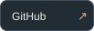
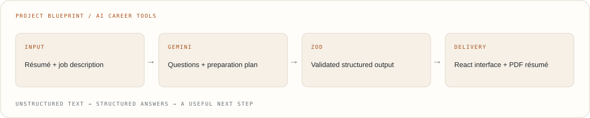
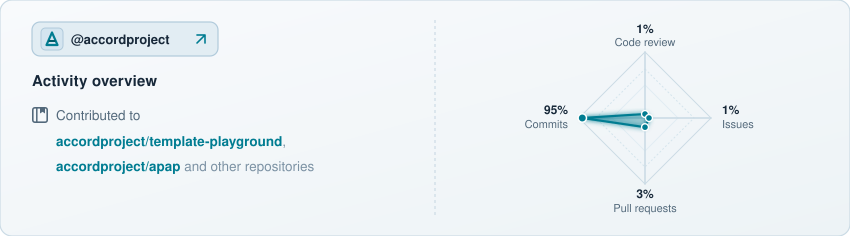

<picture>
  <source media="(prefers-color-scheme: dark)" srcset="https://raw.githubusercontent.com/Satvik77777/Satvik77777/main/assets/profile/header-dark.gif?v=2026100901">
  
</picture>

  
  
  
  
  

## About me

I’m **Satvik Saini**, a Computer Science graduate building full-stack applications with **JavaScript, TypeScript, and the MERN stack**.

My recent work explores **AI-powered career tools** and **reliable financial transaction systems**. I enjoy the parts where a useful interface meets careful backend engineering: structured AI responses, authentication, validation, and data integrity.

I also contribute to open source through **Accord Project**, and practise data structures and algorithms on [LeetCode](https://leetcode.com/u/Satvik7777/).

<picture>
  <source media="(prefers-color-scheme: dark)" srcset="https://raw.githubusercontent.com/Satvik77777/Satvik77777/main/assets/profile/pipeline-dark.gif?v=2026100901">
  
</picture>

## Selected projects

### AI Interview Prep & ATS Résumé Platform

A résumé and a job description become a focused preparation plan: role analysis, technical and behavioural questions, model answers, and a preparation roadmap.

<picture>
  <source media="(prefers-color-scheme: dark)" srcset="assets/profile/project-ai-dark.svg">
  
</picture>

- **Structured AI:** Gemini responses validated with Zod before rendering.
- **Document workflow:** pdf-parse for extraction; Puppeteer for tailored A4 résumés.
- **Authentication:** JWT in HTTP-only cookies, Bcrypt, and token blacklisting on logout.

**React · Node.js · Express · MongoDB · Gemini API · Zod · Puppeteer**

[Live demo ↗](https://interview-ai-two-xi.vercel.app/) · [Source code ↗](https://github.com/Satvik77777/interview-ai)

### Double-Entry Ledger & Transaction Service

A financial backend built around append-only ledger records, consistent transfers, and balances derived from transaction history.

<picture>
  <source media="(prefers-color-scheme: dark)" srcset="assets/profile/project-ledger-dark.svg">
  
</picture>

- **Consistency:** multi-document MongoDB ACID transactions for transfers.
- **Retry safety:** unique transaction keys for idempotent payment APIs.
- **Auditability:** immutable ledger entries and aggregation-based balances.
- **Notifications:** Nodemailer with Google OAuth 2.0.

**Node.js · Express · MongoDB · Mongoose · JWT · OAuth 2.0**

[Live demo ↗](https://backend-ledger-frontend.vercel.app/) · [Source code ↗](https://github.com/Satvik77777/backend-ledger)

Blueprints illustrate the project architecture; they are not application screenshots or benchmarks.

## Open source

### Accord Project

Contributions to the [Accord Project](https://github.com/accordproject) ecosystem, with experience working through pull requests, maintainer feedback, and code review.

[Explore my merged pull requests ↗](https://github.com/accordproject/apap/pulls?q=is%3Apr+author%3ASatvik77777+is%3Amerged) · [Pull Shark achievement ↗](https://github.com/Satvik77777?tab=achievements)

<strong>Other contribution work · Apicurio</strong>

Proposed a compatible-tools API endpoint and UI compatibility view in [Apicurio Registry PR #9045](https://github.com/Apicurio/apicurio-registry/pull/9045). This proposal was **closed without merging**.

## Toolkit

| Area | Tools |
| :--- | :--- |
| Languages | JavaScript, TypeScript, C++, HTML, CSS, SQL |
| Frontend | React, Tailwind CSS, responsive interfaces |
| Backend | Node.js, Express, REST APIs, JWT, Zod, Socket.io |
| Data | MongoDB, Mongoose, MySQL, aggregation, ACID transactions |
| AI & documents | Gemini API, prompt engineering, Puppeteer, pdf-parse |
| Workflow | Git, GitHub, Postman, npm, code review |

### Currently exploring

Structured AI output, dependable transaction APIs, and the small engineering decisions that make a product easier to use and maintain.

## A year of building

A snapshot of my public GitHub activity, with a date range and last-updated label.

<picture>
  <source media="(prefers-color-scheme: dark)" srcset="https://raw.githubusercontent.com/Satvik77777/Satvik77777/main/assets/profile/contributions-dark.gif?v=2026100903">
  
</picture>

 

  
🏢 <b>Accord Project (@accordproject) Activity &amp; Repositories</b> ▾

   
  

    <a href="https://github.com/accordproject" target="_blank" rel="noopener noreferrer" title="Open @accordproject on GitHub">
      <picture>
        <source media="(prefers-color-scheme: dark)" srcset="assets/profile/accord-activity-dark.svg">
        
      </picture>
    </a>
  

  

    📂 <b>Featured Repositories:</b>
    <a href="https://github.com/accordproject/template-playground" target="_blank" rel="noopener noreferrer"><code>template-playground</code></a> •
    <a href="https://github.com/accordproject/apap" target="_blank" rel="noopener noreferrer"><code>apap</code></a> •
    <a href="https://github.com/accordproject/concerto" target="_blank" rel="noopener noreferrer"><code>concerto</code></a> •
    <a href="https://github.com/accordproject/markdown-transform" target="_blank" rel="noopener noreferrer"><code>markdown-transform</code></a>
  

 

Small steps. Useful software. Something new to learn.

